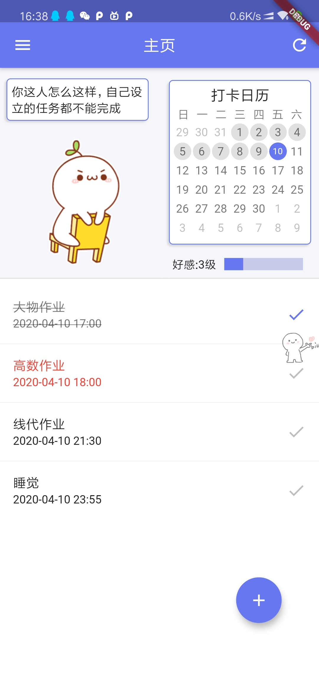
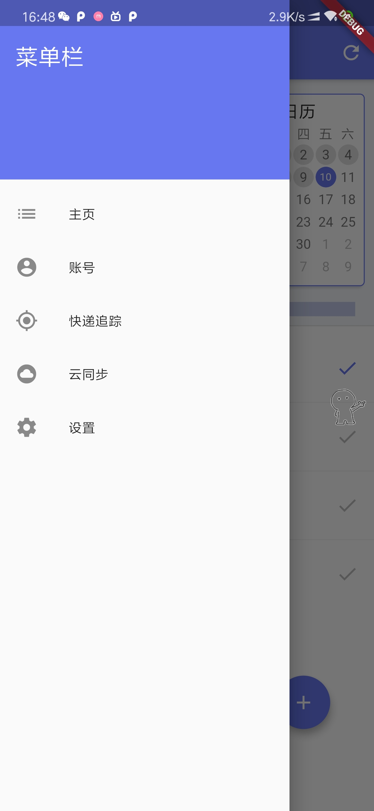
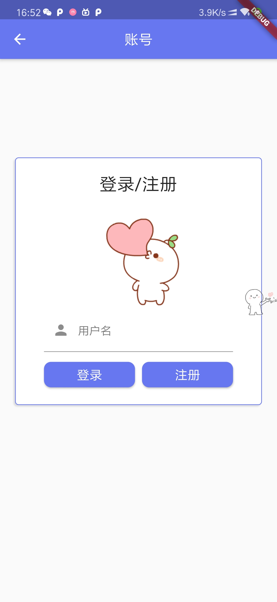
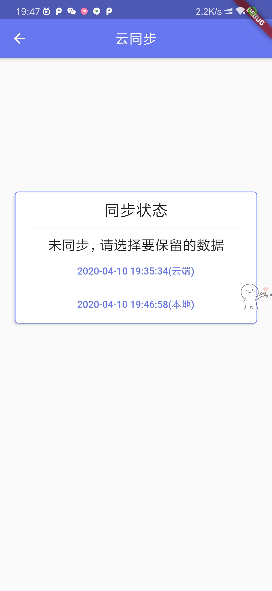
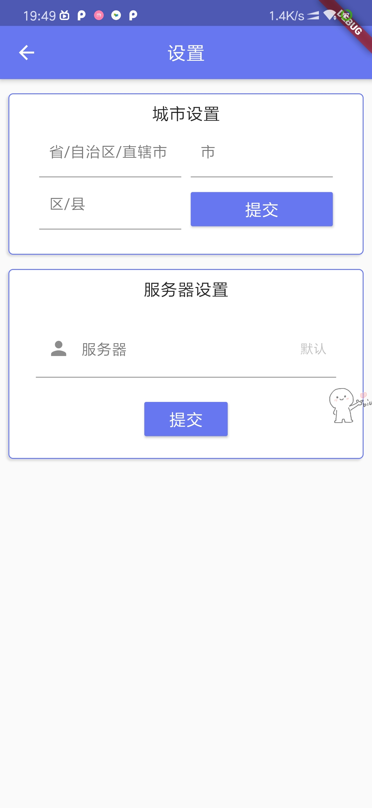

# 项目介绍

这是一个为了提升小b同学幸福感的app，由于语文水平不高于是询问了身边朋友的需求并结合自身需要，感觉主要是缺少陪伴以及在家过于咸鱼虚度光阴，所以开发此app。

对于提供陪伴主要是通过得意的颜团子以及通知栏的骚扰（误）来提供，每天特定时间会有通知提醒提供关怀。

而解决咸鱼则是前端所实现的主要功能，通过把每天所需要做的事项列出来，并且通过打卡日历督促每天坚持，灵感来自于百词斩的打卡日历。

# 使用

于[release](https://github.com/Xander-C/Brain_hole/releases)中下载最新版本的apk，安装到安卓手机上，打开"幸福清单"app。

## 主页

点击右下角可以新增待办事项，代办事项表中单点可以将一件事设置为为已完成(不可撤销)，长按可删除该事件，当所有的当天事件删除后将会在打开日历上涂上色，完成一件事与最终完成所有事项（非当天长期事项不计在内）均可获得颜团子的好感。

### 关于好感度计算

* 点击完成任务+5
* 完成当天所有当天任务+10
* 任务到期未完成-30（可能会出现好感度一直是0不增加的情况，是因为这个好感减到了0以下）

## 菜单

第一项是主页，点了返回主页

第二项是账号，可以进入设置云同步账号。

## 账号

由于平时使用各种小网站特别反感要注册一个只用一次的账号，所以这里使用了了一个不需要密码的登录方式，只设置一个用户名，用户名同时充当用户名与密码，第一次使用输入用户名后点击注册，如果显示账号已存在请确定该账号是否是你的，如果不是请不要使用登录，所以这里**建议使用比较特别的用户名** 。登录后回到主页请点击一下右上角的刷新按钮刷新一下数据。

## 快递追踪

``没时间做了占着菜单栏长点好看点``

## 云同步

登录后进入会自动检测云同步状态，若出现冲突可以在此确定需保留的数据。

## 设置

首页的小人说的话带有天气预报功能，因此需要设置所在地。而作者的服务器最终总会咕咕咕所以提供了更改服务器的选项。

# 已知bug

* 安装后首次打开可能会无法使用一些功能，请安装后多重启几次app。

如若发现云服务无法使用请自己搭建，[地址](https://github.com/Xander-C/brainHole_backend)